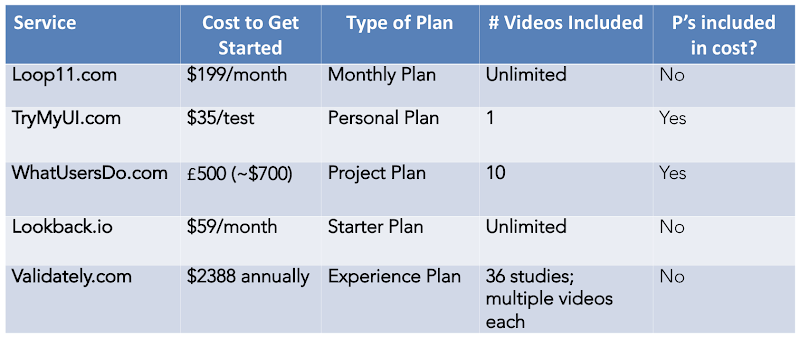

### _Step 1: Recruiting participants with low-cost tools_

Have you tried arguing that you can save your company or clients time and money by using remote unmoderated research tools?

If so, you'll know that it can be difficult to get buy-in at smaller companies, agencies, and other organizations. That’s because the big players (UserZoom and UserTesting.com) have raised prices to go after big enterprises. These companies charge tens of thousands (and in some cases hundreds of thousands) for access to their tools, putting them out of range for many companies.

In other words, even though remote unmoderated testing is supposed to be a Lean technique, often in practice, it isn’t. When that happens, too much of the UX budget goes to paying for the tools, sometimes leaving too little for the research efforts that will result in the greatest insights.

Some lower-cost solutions for remote unmoderated testing exist (see Table) including [Loop11](https://www.loop11.com/){:target="\_blank"}, [Validately](https://validately.com/){:target="\_blank"}, and [WhatUsersDo](https://www.whatusersdo.com/){:target="\_blank"} (recently acquired by [UserZoom](https://www.userzoom.com/){:target="\_blank"}). These can be a good option for some applications but can be limiting in other cases unless you purchase a higher level of service. For example, at the basic level of service, [TryMyUI](https://www.trymyui.com/){:target="\_blank"} is limited to 20 minutes or less of testing and doesn’t include screener questions.

So what do you do if you need full-function remote unmoderated testing at a bare-bones cost?

Keep reading Part I of our series to find out our recommendations (and a few tips) for recruiting participants, the first step in creating low-cost alternatives to remote research.

In this first installment, we’ll walk you through some of our favorite current recruitment tools and what they can offer, and why you might want to choose one over another. We’ll tell you when to deploy them and how much they cost, including a few zero-cost recruitment options.

Then, check out the full series to find out about the next steps:

[Step 2: Inviting & Preparing Participants](/blog/low-cost-research-tools-part-2){:target="\_blank"}

[Step 3: Sharing Tasks & Recording Participants](/blog/low-cost-research-tools-part-3){:target="\_blank"}

[Step 4: Verifying Success & Paying Participants](/blog/low-cost-research-tools-part-4){:target="\_blank"}

 

# Step 1: Recruiting Participants

Finding participants has never been easier with today’s tools for recruiting. This is great news for researchers who had to rely on outsourcing to costly recruiters in the past. It also means that you don’t need to rely on the full-service user panels supplied by higher-cost integrated solutions like UserTesting. It’s now fast and easy to recruit users, and in many cases, doing it yourself is more effective at targeting exactly who you need to hear from, raising the quality of your research insights.

 

## Intercept recruiting tools

_Best for: When you want to recruit actual customers who are on your site._

- [Hotjar.com](https://www.hotjar.com/){:target="\_blank"} is an “all in one” analytics and feedback tool that does heatmapping and surveys. Hotjar can also be used to recruit customers via intercept messages that can be easily created and applied across your site or on specific devices or pages. Current Cost: Free for low volume sites or _$29/month sites with up to 10,000 page views per day_.

- [Ethn.io](https://ethn.io/){:target="\_blank"} allows you to find participants via intercept messages anywhere on your site or across devices and screen them. Current Cost: _$79/month for small organizations_.

 

## General recruiting tools

_Best for: When you want to recruit general users (or those in particular demographics/job titles) who may not yet be aware of using your site (and therefore can’t be intercepted)._

- [userinterviews.com](https://www.userinterviews.com/){:target="\_blank"} is good for general recruiting and has built-in screener tools. Verification via LinkedIn/Facebook is available for many of the participants. **Typical Cost:** _$10-20 incentive plus approx $20 recruiting fee_.

- [respondent.io](https://www.respondent.io/){:target="\_blank"} has LinkedIn verification and built-in screener tools as well as a unique angle of allowing you to select participants by particular job titles/industries. The interface is very user-friendly. **Typical Cost:** _$10-20 incentive plus 35% recruitment fee and 3% merchant processing fee_.

 

## Free or DIY recruiting tools

_Best for: When you have zero budget for recruiting. Also good for recruiting specialized user populations that are hard to reach otherwise, but who self-organize around hashtags or in Facebook or Reddit groups. Another advantage of recruiting this way is that you can recruit from a pool of “naive” participants, as opposed to those who’ve done repeated testing, thus avoiding “expert participants” who may be undesirable in some applications._

- [Craigslist.com](https://www.craigslist.com/){:target="\_blank"} can be a great free option for recruiting users of all types. The 8 gigs subsections give you the ability to target particular groups. Use Computer Gigs to find technically-minded people, Labor Gigs to reach hands-on workers, and so on. Then use a screener survey to further refine. **Typical Cost:** $10-25 incentive cost only.

- **Social media** is another low-cost option for finding users in niche groups with special interests or characteristics. Facebook Groups or Reddit for specialized interest groups can be a rich resource and place to post recruitments. There are Facebook Groups and Reddit for enthusiasts of certain products/services or even people dealing with particular medical conditions. Twitter and Instagram hashtags can also be deployed to get your recruitment message out to particular interest groups. Get creative and think outside the box! You will be rewarded with participants who can speak authentically to the issues you are interested in. **Typical Cost:** _$10-25 incentive cost only_.

 

## User panels in all-in-one remote testing tools

_Best for: When you have a straightforward user testing situation and want to get the job done using an all-in-one solution._

- [TryMyUI.com](https://www.trymyui.com/){:target="\_blank"} is the only all-in-one remote testing solution that allows you to get started with a small upfront commitment, but still includes access to panels of participants. You can pay as you go, as long as you don’t require more than 20 minutes of testing or complex screeners. If you do need screening questions or sessions longer than 20 minutes, you’ll have to upgrade to a higher level of service. **Current Cost:** _$35 per test for Personal Plan $299/month for Team Plan_.

 

## Experiment Zone’s Recruiting Tips

- Be hyper-vigilant with your screener to get the best participants (and prevent anyone from “gaming” the system to get into your study).

- Recruit more participants than you’ll actually use (this is probably familiar ground to a lot of researchers), as there will always be participants who struggle with technology, or have technical glitches.

- As a side note, we view it as a distinct advantage to have full control over recruiting our participants from whatever source works best for our needs, as the user panels at the one-stop services like usertesting.com or TryMyUI can be limited--and also run the risk of being overpopulated with ‘expert participants’ who might not represent your typical user.

Anyone who’s not satisfied with their current pricing or workflow for recruiting users for remote testing should definitely take a look at these new tools for recruiting (and others we may not have discovered yet) and see how they can work for you--using our workflow or inventing your own. The power is definitely in our hands now and it’s on all of us to use it creatively to build a better world.

To find out how to save time and money on your remote user-testing workflows, keep reading:

[Step 2: Inviting & Preparing Participants](/blog/low-cost-research-tools-part-2){:target="\_blank"}

[Step 3: Sharing Tasks & Recording Participants](/blog/low-cost-research-tools-part-3){:target="\_blank"}

[Step 4: Verifying Success & Paying Participants](/blog/low-cost-research-tools-part-4){:target="\_blank"}

We’d love to hear what’s working for you to hack your user testing workflows! Email us at <info@experimentzone.com>{:target="\_blank"}.


