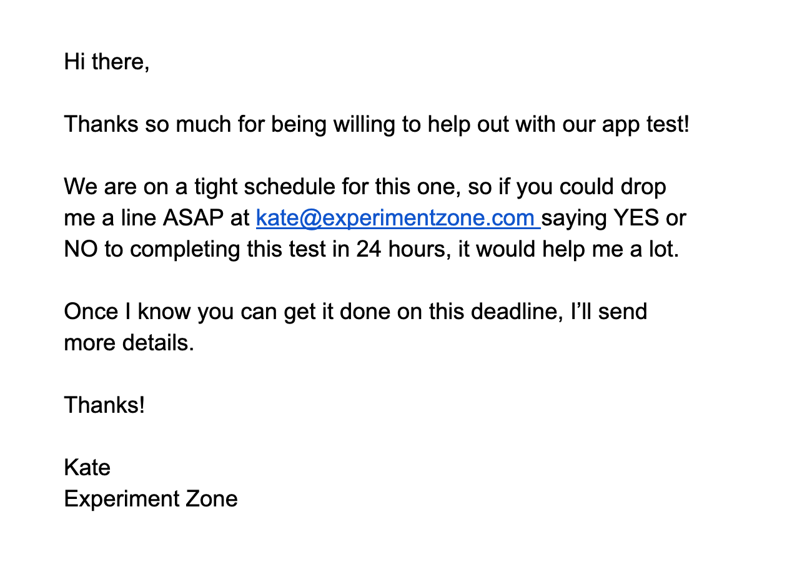
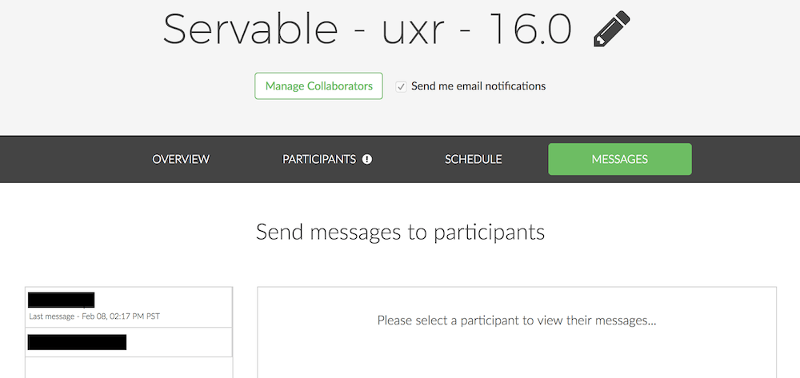

### _Step 2: Inviting & preparing research participants_

Welcome to the second part of our series on how to create an ultra-low-cost remote unmoderated user testing flow that allows you to reduce spending on UX tools, so you can focus your UX budget on planning your UX research strategy, designing good questions, analyzing the data, and capturing insights in reports and communications that will inspire positive change.

In [Part 1](/blog/low-cost-research-tools-part-1){:target="\_blank"} of our series, we shared our recommendations and a few tips for recruiting participants using low- or no-cost tools.

Once you’ve got participants, however, you need to follow through and make sure they actually show up primed, prepped, and ready to complete your remote unmoderated user test. Since you won’t be using integrated workflows that exist to manage participants in all-in-one testing solutions like UserTesting, it will be important to put some effort into this. The first step is when you invite them and send details of the test that will enable them to complete the test independently without your further intervention.

Continue reading for the second installment in this series, as we walk you through our tried and tested approaches for making sure you get your participants in front of your test in a timely and efficient way, without fielding questions or dealing with delays caused by no-shows.

Then, check out the full series to find out about the other steps:

[Step 1: Recruiting Participants](/blog/low-cost-research-tools-part-1){:target="\_blank"}

[Step 3: Sharing Tasks & Recording Participants](/blog/low-cost-research-tools-part-3){:target="\_blank"}

[Step 4: Verifying Success & Compensating Participants](/blog/low-cost-research-tools-part-4){:target="\_blank"}

# Inviting & Preparing Participants

Do you already have participants, or have you found them using the recruiting tools we talked about in [Step 1](/blog/low-cost-research-tools-part-1){:target="\_blank"}?

Next, you’ll need to invite them and share information on how the remote research will be conducted.

Remote unmoderated testing doesn’t typically require scheduling a particular time slot (it’s done on the participant’s own schedule), but it does involve setting an expectation or deadline by which the test should be completed.

Participants also need the details of what website URL they need to go to in order to start the test. Explain to participants what you are looking for in terms of “think aloud” and set their expectations for how the test will work operationally.

Use a 5W1H Message
Create a cut-and-pasteable document that gives participants the nitty-gritty details -- the Who, What, Where, When, Why, and How (5W1H) details of your test (including, the deadline for completing it). These details will set expectations for what’s needed to have a successful test. Use this message with all your participants.

An example of a 5W1H email/message we use for testing with Lookback is here. (Learn more about Lookback in [Part 3](/blog/low-cost-research-tools-part-3){:target="\_blank"} of this series).

When time is tight, start with a “Warm Body” Message
To cut down on no-shows & delays (e.g., when you need results from a single guinea pig participant asap) don’t hit your participant with your 5W1H message upfront.

Instead, start your invitation process with a personal appeal asking them to affirm they can do the test on the needed time frame. This sets expectations and shows them there’s a real, live person (warm body) on the other end who’s counting on them.

It also lets you know right away if someone is going to be a no-show.

An example of a Warm Body message:

This isn’t necessary when you have plenty of time and the option to invite MORE participants than you need (eventually someone will respond).

Tools:

1.  **Email** is the obvious choice for communicating with participants if you recruited them via a site intercept or social media, Craigslist, or other DIY methods that we discussed in [Part 1](/blog/low-cost-research-tools-part-1){:target="\_blank"}. Email makes it easy to simply cut and paste your Warm Body and 5W1H messages to participants.

2.  **“Invite” or “Approve” inside Recruiting Tools**. Sites like [userinterviews.com](https://www.userinterviews.com/){:target="\_blank"} and [respondent.io](https://www.respondent.io/){:target="\_blank"} have strict rails on the communication with participants. You’ll invite your participants using “invite” or “approve” options within the site. At this point, you’ll also have an option to paste in your Warm Body or 5W1H message.

UserInterviews also offers a messaging option once a participant has accepted your invitation.

3.  **“Order Testers” in TryMyUI**. TryMyUI is the lowest price all-in-one option for remote unmoderated testing (see our Table in [Part 1](/blog/low-cost-research-tools-part-1){:target="\_blank"}). If you run your test in TryMyUI, you’ll order testers there as well.

 

## Experiment Zone’s Tips

- In your communication about remote unmoderated testing, set participants’ expectations for what the test will involve as well as making your own expectations clear. Both are important.
- The participants you’ll be recruiting likely have not gone through any kind of training for remote unmoderated testing, and in some cases, won’t have ever encountered this kind of a study, so you’ll need to cover the basics.
- - Cover each step they’ll need to do to get set up, such as enabling microphone, screen sharing, and audio, or downloading an extension.
- - Remind participants to find a quiet spot This might seem obvious, but some participants need to be informed, otherwise, you and your stakeholders may be struggling to hear the feedback while ignoring the chaos in the background of the video.
- - Let them know you’re expecting them to “think aloud”--and explain what “think aloud” is.
- Don’t forget to include the link to the page they’ll navigate to in order to start their test.
- If there are consequences for failing to use the technology correctly (such as not being paid if they don’t share their screen and/or upload a video), spell those out when you prepare your participants. It will help resolve the situation if things go awry.

Inviting and preparing your participants for remote unmoderated testing is important because it sets the stage for a successful and timely test without any intervention by you (such as responding to multiple emails/messages from confused participants).

By following the suggestions we’ve outlined here, you greatly increase the chances of getting usable data from each and every participant.

To continue finding out how to save time and money on your remote user-testing workflows, keep reading:

[Step 3: Sharing Tasks & Recording Participants](/blog/low-cost-research-tools-part-3){:target="\_blank"}

[Step 4: Verifying Success & Compensating Participants](/blog/low-cost-research-tools-part-4){:target="\_blank"}


