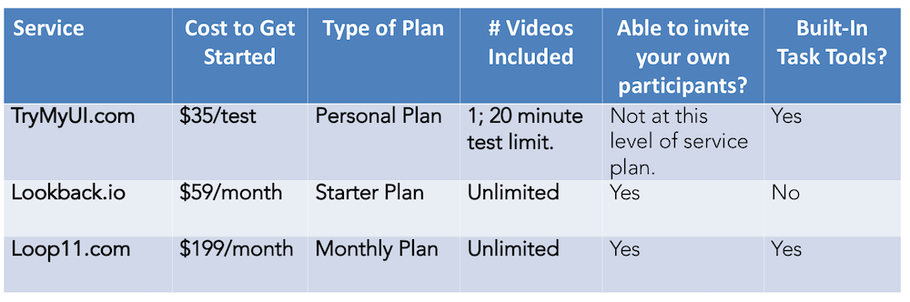

### _Step 3: Sharing Tasks & Recording Participants_

Welcome to the third part of our series on how to create an ultra-low-cost remote unmoderated user testing flow that allows you to reduce spending on UX tools, so you can focus your UX budget on planning your UX research strategy, designing good questions, analyzing the data and capturing insights in reports and communications that will inspire positive change.

In [Part 2](/blog/low-cost-research-tools-part-2){:target="\_blank"} of our series, we shared our recommendations and a few tips for inviting and preparing participants for testing, after you recruited them using the low-cost or free options we described in [Part 1](/blog/low-cost-research-tools-part-1){:target="\_blank"}. With these two steps, your participants are primed, prepped, and ready for a successful remote unmoderated test.

Now, how do you share tasks and record their video/audio as well as their actions on the screen?

Continue reading for the third installment in this series, as we walk you through several low-cost options for doing this. There are a number of new or evolving tools that can help.

Then, check out the full series to find out about the other steps:

[Step 1: Recruiting Participants](/blog/low-cost-research-tools-part-1){:target="\_blank"}

[Step 2: Inviting & Preparing Participants](/blog/low-cost-research-tools-part-2){:target="\_blank"}

[Step 4: Verifying Success & Compensating Participants](/blog/low-cost-research-tools-part-4){:target="\_blank"}

# Sharing Tasks & Recording Participants

There are three main options for recording participants that we consider low cost as of the time of publishing this article. Two of them (Lookback and Loop11) offer the option to invite your own participants. These options also vary in terms of the built-in task tools available at the current time.

Recording tools - Unmoderated

- [Lookback.io](https://lookback.io/){:target="\_blank"} allows you to record users during remote unmoderated (or moderated) testing. At the time of this article, Lookback does not have built-in task tools although reportedly they will be offering those in the near future. In the meantime, we have developed a method for using Google Forms to share tasks when using Lookback for recording. This combination of tools is ridiculously low cost and very flexible, offering few limitations if any.

- [Loop11](https://www.loop11.com/){:target="\_blank"} is another option for recording users, and it includes built-in task tools. As a bonus, it includes a “Learn How to Think Aloud” video at the beginning of sessions to help prepare participants. In Loop11, you don’t have the ability to edit tasks once the test is launched.

- [TryMyUI](https://www.trymyui.com/){:target="\_blank"} can be a low-cost option for sharing tasks and recording participants in remote unmoderated testing as long as you are okay with the limitations of lower-level plans. For example, you’ll only have 20-30 minutes of recording time, limited ability to screen participants, and limited ability to invite your own participants at these lower levels. To get ultimate flexibility, you’ll need Enterprise level, which starts at $1000/month at the time of this writing.

- Other options, like WhatUsersDo and Validately (see Table in [Part 1](/blog/low-cost-research-tools-part-1){:target="\_blank"}) require a bigger upfront commitment to enter and access their platforms (~$700 and $2388, respectively), which makes them a viable option for agencies and enterprises, but less desirable for startups or others who may be doing lower volumes of testing on a tight budget at any given time.

 

## Experiment Zone’s Tips

- When users work with tools for recording user tests, there may be technical glitches, whether that’s from user inexperience with the platforms, or volatility in platforms that are still relatively new and rapidly evolving.
- Be prepared for the occasional technological hiccup and have a plan for dealing with adverse events when they happen. When something goes wrong through no fault of your participant, the best policy is to reimburse them for the session. You’ll still end up saving money in the long run.

Sharing tasks and recording participants has never been easier to accomplish at low price points with tools like Loop11, Lookback.io, and TryMyUI. We anticipate that these options for recording unmoderated user tests will just get better and better with time, and they are well worth becoming familiar with and integrating into your current workflows now.

To continue finding out how to save time and money on your remote user-testing workflows, keep reading:

[Step 4: Verifying Success & Compensating Participants](/blog/low-cost-research-tools-part-4){:target="\_blank"}


